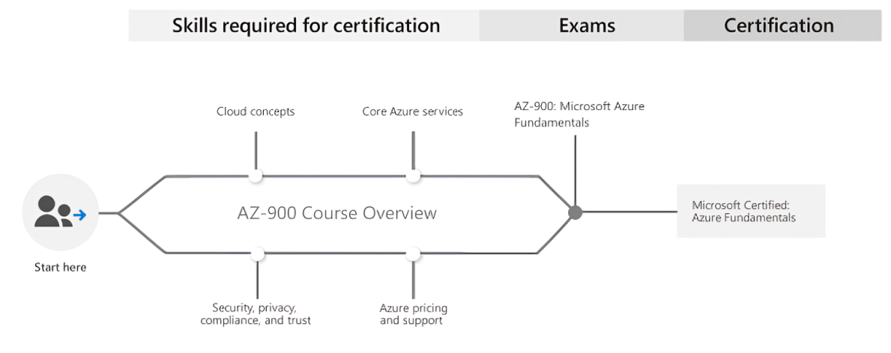

# About

## AZ-900 Microsoft Azure Fundamentals

AZ-900 Microsoft Azure Fundamentals certification is the first and the most important certification for anyone who is just starting with Azure. It’s very exciting for me to release this course to everyone!

## Path Overview

## Navigation

### Chapters

#### Module 1
- [Chapter 1: Cloud Computing, High Availability, Scalability, Elasticity, Agility, Fault Tolerance, and Disaster Recovery](Module%201/Chapter%20-%2001.md)
- [Chapter 2: Principles of economies of scale](Module%201/Chapter%20-%2002.md)
- [Chapter 3: Capital Expenditure (CapEx) vs Operational Expenditure (OpEx) and their differences](Module%201/Chapter%20-%2003.md)
- [Chapter 4: Consumption-based model](Module%201/Chapter%20-%2004.md)
- [Chapter 5: IaaS, PaaS, SaaS and their differences](Module%201/Chapter%20-%2005.md)
- [Chapter 6: Public, Private, Hybrid cloud and their differences](Module%201/Chapter%20-%2006.md)

#### Module 2
- [Chapter 7: Azure Regions and Availability Zones](Module%202/Chapter%20-%2007.md)
- [Chapter 8: Azure Resource Groups and Resource Manager](Module%202/Chapter%20-%2008.md)
- [Chapter 9: Azure Compute Services | Virtual Machine, VM Scale Set, App Service, Functions, Container Instances, Kubernetes Service](Module%202/Chapter%20-%2009.md)
- [Chapter 10: Azure Networking Services | Virtual Network, Load Balancer, VPN Gateway, Application Gateway, CDN](Module%202/Chapter%20-%2010.md)
- [Chapter 11: Azure Storage Services | Blob, Disk, File and Archive](Module%202/Chapter%20-%2011.md)
- [Chapter 12: Database Services | Cosmos DB, SQL Database, SQL DB for MySQL and PostgreSQL, SQL Managed Instance](Module%202/Chapter%20-%2012.md)
- [Chapter 13: Azure Marketplace](Module%202/Chapter%20-%2013.md)
- [Chapter 14: Azure IoT Services | IoT Hub, IoT Central, Azure Sphere](Module%202/Chapter%20-%2014.md)
- [Chapter 15: Azure Big Data and Analytics Services | Synapse Analytics (SQL Datawarehouse), HDInsight, Databricks](Module%202/Chapter%20-%2015.md)
- [Chapter 16: Azure Artificial Intelligence (AI) Services | Machine Learning Studio and Service](Module%202/Chapter%20-%2016.md)
- [Chapter 17: Azure Serverless Computing Services | Functions, Logic Apps, Event Grid](Module%202/Chapter%20-%2017.md)
- [Chapter 18: Azure DevOps Solutions | Azure DevOps, DevTest Labs](Module%202/Chapter%20-%2018.md)
- [Chapter 19: Azure Tools | Portal, PowerShell, CLI and CloudShell](Module%202/Chapter%20-%2019.md)
- [Chapter 20: Azure Advisor](Module%202/Chapter%20-%2020.md)

#### Module 3
- [Chapter 21: Security Groups | NSG and ASG | Network Security Groups and Application Security Groups](Module%203/Chapter%20-%2021.md)
- [Chapter 22: User-defined Routes (UDR)](Module%203/Chapter%20-%2022.md)
- [Chapter 23: Azure Firewall](Module%203/Chapter%20-%2023.md)
- [Chapter 24: Azure DDoS Protection](Module%203/Chapter%20-%2024.md)
- [Chapter 25: Azure Identity Services | Identity, Authentication, Authorization & Azure AD](Module%203/Chapter%20-%2025.md)
- [Chapter 26: Azure Security Center and usage scenarios](Module%203/Chapter%20-%2026.md)
- [Chapter 27: Key Vault](Module%203/Chapter%20-%2027.md)
- [Chapter 28: Role-Based Access Control (RBAC)](Module%203/Chapter%20-%2028.md)
- [Chapter 29: Resource Locks](Module%203/Chapter%20-%2029.md)
- [Chapter 30: Tags](Module%203/Chapter%20-%2030.md)
- [Chapter 31: Azure Policy](Module%203/Chapter%20-%2031.md)
- [Chapter 32: Azure Blueprints](Module%203/Chapter%20-%2032.md)
- [Chapter 33: Cloud Adoption Framework](Module%203/Chapter%20-%2033.md)
- [Chapter 34: Core tenets of Security, Privacy, and Compliance](Module%203/Chapter%20-%2034.md)

#### Module 4
- [Chapter 35: Cost Affecting Factors](Module%204/Chapter%20-%2035.md)
- [Chapter 36: Cost Reduction Methods and Pricing, TCO Calculators](Module%204/Chapter%20-%2036.md)
- [Chapter 37: Azure Cost Management](Module%204/Chapter%20-%2037.md)
- [Chapter 38: Azure Service Level Agreement (SLA)](Module%204/Chapter%20-%2038.md)
- [Chapter 39: Service lifecycle in Azure](Module%204/Chapter%20-%2039.md)

---
