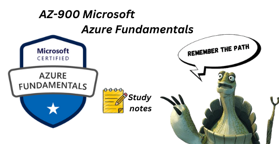

# Home

## AZ-900 Azure Fundamentals

Welcome to the AZ-900 Azure Fundamentals study guide! This website offers a comprehensive overview and study content to help you prepare for the Microsoft Azure Fundamentals exam. Whether you're new to Azure or looking to refresh your knowledge, you'll find everything you need here.

<!-- Image and Lottie animation side by side -->

  <!-- AZ-900 Image -->
  

    
    
AZ-900 Study Guide

  

  <!-- Lottie Animation -->
  

    <dotlottie-wc 
      src="https://lottie.host/bfe82ae8-4dba-4259-8fce-1b2d690c1e31/hliooJaNMm.lottie" 
      style="width: 400px; height: 400px;" 
      speed="1.2" 
      autoplay 
      loop>
    </dotlottie-wc>
  

<!-- Lottie Script -->

---

## Contact

If you have any questions or need further assistance, feel free to reach out to me at [2004.vimald@gmail.com](mailto:2004.vimald@gmail.com).

Good luck with your exam preparation!
